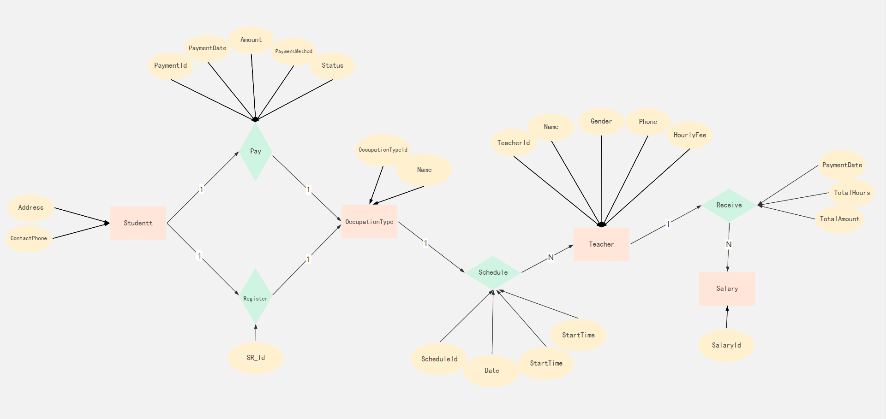

# 数据库开发分支

## 1. 需求分析

### 1.1. **教师（Teacher） 与 职业作息安排（OccupationSchedule）**

- **关系名：** 教授（`teaches`）
- **类型：** 一对多（1:N）
- **描述：** 每位教师可以参与多次职业作息安排，每次安排对应一个具体的职业登记（OccupationRegistration）、日期和时间段。
- **反向理解：** 一个作息安排只能关联一个教师。

------

### 1.2. **职业登记（OccupationRegistration） 与 职业作息安排（OccupationSchedule）**

- **关系名：** 被安排（`scheduled-for`）
- **类型：** 一对多（1:N）
- **描述：** 每次职业登记（如某学生家庭的家教需求）可以安排多次不同时间段的教学作息，每次可能由不同的教师承担。
- **反向理解：** 每次作息安排仅属于一个职业登记。

------

### 1.3. **教师（Teacher） 与 工资（Salary）**

- **关系名：** 获得工资（`receives`）
- **类型：** 一对多（1:N）
- **描述：** 每位教师可以收到多次工资记录（例如每月结算一次）。
- **每条工资记录包含：** 课时数、支付日期和总金额等。

------

### 1.4. **职业登记（OccupationRegistration） 与 收费记录（Payment）**

- **关系名：** 支付（`pays-for`）
- **类型：** 一对多（1:N）
- **描述：** 每个职业登记可能产生多次付款（例如按月或按课时结算），用于支付给机构或教师。
- **每笔付款记录包含：** 金额、支付方式、支付状态等。

------

### 1.5. **职业类型（OccupationType） 与 职业登记（OccupationRegistration）**

- **关系名：** 类型归属（`has-type`）
- **类型：** 一对多（1:N）
- **描述：** 每个职业登记属于某种职业类型（如“学生家长”、“培训机构”等）。
- **反向理解：** 一个职业类型可以对应多个职业登记。

## 2. E-R图绘制



## 3. 表结构定义
- **表名和字段名全部采用大驼峰方式命名，确保和后端代码的命名一致，方便数据操控**

- **导入数据库：** 使用_localhost-2025_05_26_12_52_50-dump.sql

  **教程：**[DataGrip2024--操作 Mysql 数据库备份与恢复_datagrip备份还原数据库-CSDN博客](https://blog.csdn.net/weixin_52632140/article/details/142531060)

### 3.1. 教师表 (Teacher)

| 字段名    | 数据类型    | 主键/外键 | 允许空值 | 默认值 | 说明         | 约束/备注                       |
| --------- | ----------- | --------- | -------- | ------ | ------------ | ------------------------------- |
| TeacherId | INT         | 主键      | 否       | 自增   | 教师唯一标识 | 自增主键                        |
|名字| VARCHAR(50) | -         | 否       | -      | 教师姓名     |                                 |
| Gender    | VARCHAR(2)  | -         | 否       | -      | 性别         | `CHECK (Gender IN ('男','女'))` |
| Phone     | VARCHAR(20) | -         | 否       | -      | 联系电话     | 唯一约束                        |
| HourlyFee        | DECIMAL(10,2) | -         | 否       | -      | 每小时课时费                 | `CHECK (HourlyFee > 0)` |

------

### 3.2. 职业类型表 (OccupationType)

| 字段名           | 数据类型    | 主键/外键 | 允许空值 | 默认值 | 说明                         | 约束/备注          |
| ---------------- | ----------- | --------- | -------- | ------ | ---------------------------- | ------------------ |
| OccupationTypeId | INT         | 主键      | 否       | -      | 职业类型唯一标识             | 自增主键           |
|名字| VARCHAR(50) | -         | 否       | -      | 职业类型名称（如“数学辅导”） | 唯一约束，不可重复 |

------

### 3.3. 职业登记表 (OccupationRegistration)

| 字段名           | 数据类型     | 主键/外键 | 允许空值 | 默认值 | 说明             | 约束/备注                    |
| ---------------- | ------------ | --------- | -------- | ------ | ---------------- | ---------------------------- |
| OccupationId     | INT          | 主键      | 否       | -      | 职业登记唯一标识 | 自增主键                     |
| OccupationTypeId | INT          | 外键      | 否       | -      | 关联的职业类型   | 外键引用 `OccupationType` 表 |
| Address          | VARCHAR(100) | -         | 否       | -      | 上课地址         |                              |
| ContactPhone     | VARCHAR(20)  | -         | 否       | -      | 联系电话         |                              |

------

### 3.4. 职业作息表 (OccupationSchedule)

| 字段名       | 数据类型 | 主键/外键 | 允许空值 | 默认值 | 说明                       | 约束/备注                        |
| ------------ | -------- | --------- | -------- | ------ | -------------------------- | -------------------------------- |
| ScheduleId   | INT      | 主键      | 否       | 自增   | 作息唯一标识               | 自增主键                         |
| OccupationId | INT      | 外键      | 否       | -      | 关联的职业登记             | 外键引用OccupationRegistration表 |
| TeacherId    | INT      | 外键      | 否       | -      | 关联的教师                 | 外键引用Teacher表                |
| Date         | DATE     | -         | 否       | -      | 上课日期（如`2023-10-01`） |                                  |
| StartTime    | TIME     | -         | 否       | -      | 开始时间（如`09:00`）      |                                  |
| EndTime      | TIME     | -         | 否       | -      | 结束时间（如`11:00`）      |                                  |

------

### 3.5. 工资表 (Salary)

| 字段名      | 数据类型      | 主键/外键 | 允许空值 | 默认值 | 说明                           | 约束/备注              |
| ----------- | ------------- | --------- | -------- | ------ | ------------------------------ | ---------------------- |
| SalaryId    | INT           | 主键      | 否       | 自增   | 工资单唯一标识                 | 自增主键               |
| TeacherId   | INT           | 外键      | 否       | -      | 关联的教师                     | 外键引用Teacher表      |
| PaymentDate | DATE          | -         | 否       | -      | 工资发放日期（如`2023-10-05`） |                        |
| TotalHours  | DECIMAL(10,2) | -         | 否       | -      | 总授课时长（小时）             | 通过存储过程计算       |
| TotalAmount | DECIMAL(10,2) | -         | 否       | -      | 应发工资总额                   | TotalHours × HourlyFee |

------

### 3.6. 收费表 (Payment)

| 字段名        | 数据类型      | 主键/外键 | 允许空值 | 默认值 | 说明                       | 约束/备注                        |
| ------------- | ------------- | --------- | -------- | ------ | -------------------------- | -------------------------------- |
| PaymentId     | INT           | 主键      | 否       | 自增   | 收费记录唯一标识           | 自增主键                         |
| OccupationId  | INT           | 外键      | 否       | -      | 关联的职业登记             | 外键引用OccupationRegistration表 |
| PaymentDate   | DATE          | -         | 否       | -      | 缴费日期（如`2023-10-02`） |                                  |
| Amount        | DECIMAL(10,2) | -         | 否       | -      | 缴费金额                   | 必须大于0                        |
| PaymentMethod | VARCHAR(20)   | -         | 否       | -      | 支付方式                   | （“支付宝” “现金” "银行卡"）     |
|状态| VARCHAR(10)   | -         | 否       | 未支付 | 支付状态（已支付/未支付）  | ENUM('已支付','未支付')          |

------
## 4. MySQL编写
- 创建数据库

```mysql
CREATE DATABASE TutorServiceDB;
USE TutorServiceDB;
```
- 建表

1. 教师表 (Teacher)

```mysql
CREATE TABLE Teacher (
    TeacherId INT PRIMARY KEY AUTO_INCREMENT,
    Name VARCHAR(50) NOT NULL,
    Gender VARCHAR(2) NOT NULL CHECK (Gender IN ('男', '女')),
    Phone VARCHAR(20) NOT NULL UNIQUE,
    HourlyFee DECIMAL(10,2) NOT NULL CHECK (HourlyFee > 0)
);
```
2. 职业类型表 (OccupationType)

```mysql
CREATE TABLE OccupationType (
    OccupationTypeId INT PRIMARY KEY AUTO_INCREMENT,
    Name VARCHAR(50) NOT NULL UNIQUE
);
```
3. 职业登记表 (OccupationRegistration)

```mysql
CREATE TABLE OccupationRegistration (
    OccupationId INT PRIMARY KEY AUTO_INCREMENT,
    OccupationTypeId INT NOT NULL,
    Address VARCHAR(100) NOT NULL,
    ContactPhone VARCHAR(20) NOT NULL,
    FOREIGN KEY (OccupationTypeId) REFERENCES OccupationType(OccupationTypeId)
);
```
4. 职业作息表 (OccupationSchedule)

```mysql
CREATE TABLE OccupationSchedule (
    ScheduleId INT PRIMARY KEY AUTO_INCREMENT,
    OccupationId INT NOT NULL,
    TeacherId INT NOT NULL,
    Date DATE NOT NULL,
    StartTime TIME NOT NULL,
    EndTime TIME NOT NULL,
    UNIQUE (OccupationId,TeacherId),
    FOREIGN KEY (OccupationId) REFERENCES OccupationRegistration(OccupationId),
    FOREIGN KEY (TeacherId) REFERENCES Teacher(TeacherId),
    CHECK (EndTime > StartTime)
);
```

5. 工资表 (Salary)

```mysql
CREATE TABLE Salary (
    SalaryId INT PRIMARY KEY AUTO_INCREMENT,
    TeacherId INT NOT NULL,
    TotalHours DECIMAL(10,2) NOT NULL,
    PaymentDate DATETIME,
    TotalAmount DECIMAL(10,2) NOT NULL,
    FOREIGN KEY (TeacherId) REFERENCES Teacher(TeacherId)
);
```
6. 收费表 (Payment)

```mysql
CREATE TABLE Payment (
    PaymentId INT PRIMARY KEY AUTO_INCREMENT,
    OccupationId INT NOT NULL,
    PaymentDate DATE NOT NULL,
    Amount DECIMAL(10,2) NOT NULL CHECK (Amount > 0),
    PaymentMethod VARCHAR(20) NOT NULL CHECK (PaymentMethod IN ('支付宝', '现金', '银行卡')),
    Status ENUM('已支付', '未支付') NOT NULL DEFAULT '未支付',
    FOREIGN KEY (OccupationId) REFERENCES OccupationRegistration(OccupationId)
);
```
​	7.创建索引提高查询性能
```mysql
-- 1. 教师表 (Teacher)
CREATE INDEX idx_teacher_phone ON Teacher(Phone);  -- 按手机号快速查找教师

-- 2. 职业类型表 (OccupationType)
-- Name 字段已通过 UNIQUE 约束自动创建唯一索引，无需额外索引

-- 3. 职业登记表 (OccupationRegistration)
CREATE INDEX idx_occupation_reg ON OccupationRegistration(OccupationTypeId);  -- 加速按职业类型筛选登记

-- 4. 职业作息表 (OccupationSchedule)
CREATE INDEX idx_schedule_date ON OccupationSchedule(Date, TeacherId);  -- 按日期和教师查询排班
CREATE INDEX idx_schedule_teacher ON OccupationSchedule(TeacherId);     -- 按教师统计排班

-- 5. 工资表 (Salary)
CREATE INDEX idx_salary_payment ON Salary(TeacherId, PaymentDate);  -- 按教师和日期查工资

-- 6. 收费表 (Payment)
CREATE INDEX idx_payment_date ON Payment(PaymentDate, Status);  -- 按日期和状态查缴费记录
CREATE INDEX idx_payment_occupation ON Payment(OccupationId);  -- 按职业登记查关联费用
```


## 5. 存储过程
### 5.1 统计指定日期范围内各教师的授课时间总和
1.存储过程的创建
```mysql
DELIMITER //
CREATE PROCEDURE CalculateTeacherHours(
    IN start_date DATE,
    IN end_date DATE
)
BEGIN
    SELECT 
        os.TeacherId,
        t.Name AS TeacherName,
        SUM(TIMESTAMPDIFF(HOUR, os.StartTime, os.EndTime)) AS TotalHours
    FROM OccupationSchedule os
    JOIN Teacher t ON os.TeacherId = t.TeacherId
    WHERE os.Date BETWEEN start_date AND end_date
    GROUP BY os.TeacherId, t.Name
    ORDER BY TotalHours DESC;
END //
DELIMITER ;
```
2.调用方式及功能说明
- 调用实例
```mysql
CALL CalculateTeacherHours('2023-10-01', '2023-10-31');
```
- 功能说明
    - 输入：开始日期 start_date 和结束日期 end_date
    - 输出：每位教师的 TeacherId、姓名 TeacherName 及其在指定日期范围内的总授课时长 TotalHours
    - 逻辑：
        - 使用 TIMESTAMPDIFF(HOUR, StartTime, EndTime) 计算单次授课时长（小时）
        - 按 TeacherId 分组求和，并关联 Teacher 表获取教师姓名
        - 结果按总时长降序排列

### 5.2 统计各种职业的需求次数
1.存储过程的创建
```mysql
DELIMITER //
CREATE PROCEDURE CountOccupationDemand()
BEGIN
    SELECT 
        ot.OccupationTypeId,
        ot.Name AS OccupationName,
        COUNT(orr.OccupationId) AS DemandCount
    FROM OccupationType ot
    LEFT JOIN OccupationRegistration orr ON ot.OccupationTypeId = orr.OccupationTypeId
    GROUP BY ot.OccupationTypeId, ot.Name
    ORDER BY DemandCount DESC;
END //
DELIMITER ;
```


2.调用方式及功能说明
- 调用实例
```mysql
CALL CountOccupationDemand();
```
- 功能说明
    - 输出：每种职业的 OccupationTypeId、职业名称 OccupationName 及其登记次数 DemandCount
    - 逻辑：
        - 使用 LEFT JOIN 确保即使某职业未被登记也会显示（次数为0）
        - 按 OccupationTypeId 分组统计登记次数
        - 结果按需求次数降序排列
