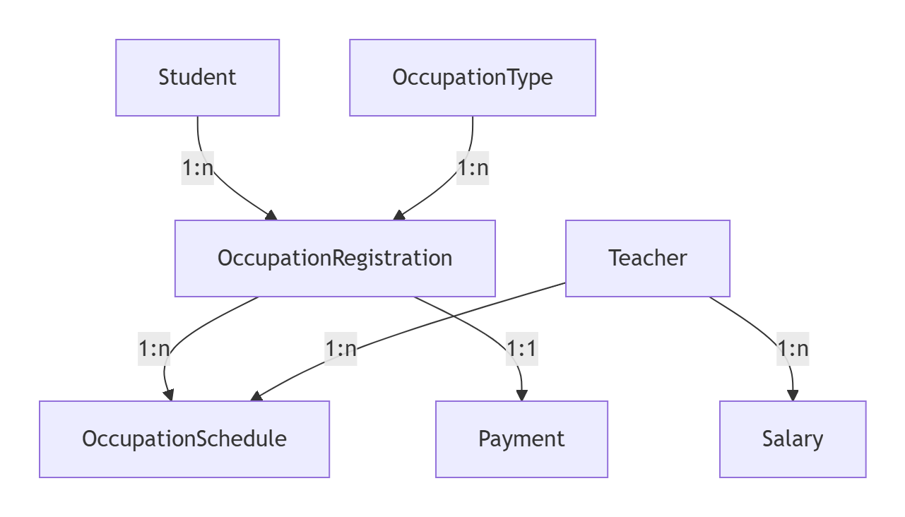

# 数据库开发分支

## 1. 需求分析

### **一、系统实现的功能**

1. **学生管理**
   - 维护学生基本信息（姓名、性别、地址、联系电话）。
   - 支持学生唯一标识和联系方式去重。
2. **教师管理**
   - 维护教师基本信息（姓名、性别、联系电话、课时费）。
   - 约束性别为“男”或“女”，联系电话唯一，课时费必须大于零。
3. **职业类型管理**
   - 定义可选的职业类型（如“数学辅导”“英语辅导”），名称唯一。
   - 为后续职业登记提供选项。
4. **职业登记管理**
   - 学生选择职业类型进行登记，关联学生与职业类型。
   - 自动触发收费记录生成（固定金额 200 元）。
5. **课程排期管理**
   - 为每个职业登记安排具体的上课日期、时间及授课教师。
   - 记录每节课的开始和结束时间，支持精确课时计算。
6. **工资自动计算**
   - 根据教师授课时长和课时费，按月统计总工资。
   - 通过触发器实时更新工资表，确保数据一致性。
7. **收费自动化**
   - 职业登记创建时自动生成缴费记录，记录当前日期。
   - 支持默认金额设定（200 元）和级联删除。

------

### **二、业务流程**

1. **学生选择职业并登记**
   - 步骤：
     1. 系统记录学生选择职业类型（如“数学辅导”）。
     2. 创建 `OccupationRegistration` 记录，关联学生与职业类型。
     3. **触发器** `AfterOccupationRegistrationInsert` 自动生成 `Payment` 记录。
2. **教师排课**
   - 步骤：
     1. 管理员为职业登记安排教师及上课时间（插入 `OccupationSchedule`）。
     2. **触发器** `AfterOccupationScheduleInsert` 实时更新 `Salary` 表的当月工资数据。
3. **课时统计与工资计算**
   - 机制：
     - 每次排课记录（增/删/改）触发工资表的更新。
     - `Salary` 表按月（`Month` 字段）汇总教师的总授课时长和工资。
4. **数据维护与清理**
   - 操作：
     - 删除学生或教师时，级联删除相关登记、排课、工资及收费记录。
     - 保证数据完整性，避免脏数据残留。

------

### **三、表之间的联系**

1. **核心关系图**



2. **外键级联说明**

   - `OccupationRegistration`
     - `StudentId` → `Student.StudentId`（级联删除）
     - `OccupationTypeId` → `OccupationType.OccupationTypeId`（级联删除）
   - `OccupationSchedule`
     - `OccupationId` → `OccupationRegistration.OccupationId`（级联删除）
     - `TeacherId` → `Teacher.TeacherId`（级联删除）
   - `Salary`
     - `TeacherId` → `Teacher.TeacherId`（级联删除）
   - `Payment`
     - `OccupationId` → `OccupationRegistration.OccupationId`（级联删除）

3. **关键数据联动**

   - **新增职业登记**：自动生成收费记录（`Payment`）。
   - **排课修改**：实时更新工资表（`Salary`）中的当月数据。
   - **删除教师/学生**：级联清理相关排课、工资、收费记录。

------

### **四、系统约束与规则**

1. **数据唯一性**
   - `Student.ContactPhone` 唯一。
   - `Teacher.Phone` 唯一。
   - `OccupationType.Name` 唯一。
2. **业务规则**
   - 性别仅允许“男”或“女”（`CHECK` 约束）。
   - 课时费必须大于零（`CHECK (HourlyFee > 0)`）。
   - 缴费金额固定为 200 元（可通过触发器扩展动态计算）。
3. **自动化规则**
   - 工资按自然月统计（`Month` 字段格式 `YYYY-MM`）。
   - 排课时间冲突需由业务逻辑处理（未在数据库层约束）。

------

## 2. 表结构定义
- **表名和字段名全部采用大驼峰方式命名，确保和后端代码的命名一致，方便数据操控**

- **导入数据库：** 使用**tutorservicedb.sql**文件

  **教程：**[DataGrip2024--操作 Mysql 数据库备份与恢复_datagrip备份还原数据库-CSDN博客](https://blog.csdn.net/weixin_52632140/article/details/142531060)

#### **1. 学生表（Student）**

```mysql
CREATE TABLE Student (
    StudentId INT PRIMARY KEY AUTO_INCREMENT,
    Name VARCHAR(50) NOT NULL,
    Gender VARCHAR(2) NOT NULL CHECK (Gender IN ('男', '女')),
    Address VARCHAR(20) NOT NULL,
    ContactPhone VARCHAR(20) NOT NULL UNIQUE
);
```

| 字段名       | 数据类型    | 主键/外键 | 允许空值 | 默认值 | 说明         | 约束/备注                       |
| ------------ | ----------- | --------- | -------- | ------ | ------------ | ------------------------------- |
| StudentId    | INT         | 主键      | 否       | 自增   | 学生唯一标识 | 自增主键                        |
| Name         | VARCHAR(50) | -         | 否       | -      | 学生姓名     |                                 |
| Gender       | VARCHAR(2)  | -         | 否       | -      | 性别         | `CHECK (Gender IN ('男','女'))` |
| Address      | VARCHAR(20) | -         | 否       | -      | 家庭地址     |                                 |
| ContactPhone | VARCHAR(20) | -         | 否       | -      | 联系电话     | 唯一约束                        |

------

#### **2. 教师表 (Teacher)**

```mysql
CREATE TABLE Teacher (
    TeacherId INT PRIMARY KEY AUTO_INCREMENT,
    Name VARCHAR(50) NOT NULL,
    Gender VARCHAR(2) NOT NULL CHECK (Gender IN ('男', '女')),
    Phone VARCHAR(20) NOT NULL UNIQUE,
    HourlyFee DECIMAL(10,2) NOT NULL CHECK (HourlyFee > 0)
);
```

| 字段名    | 数据类型      | 主键/外键 | 允许空值 | 默认值 | 说明         | 约束/备注                       |
| --------- | ------------- | --------- | -------- | ------ | ------------ | ------------------------------- |
| TeacherId | INT           | 主键      | 否       | 自增   | 教师唯一标识 | 自增主键                        |
| Name      | VARCHAR(50)   | -         | 否       | -      | 教师姓名     |                                 |
| Gender    | VARCHAR(2)    | -         | 否       | -      | 性别         | `CHECK (Gender IN ('男','女'))` |
| Phone     | VARCHAR(20)   | -         | 否       | -      | 联系电话     | 唯一约束                        |
| HourlyFee | DECIMAL(10,2) | -         | 否       | -      | 每小时课时费 | `CHECK (HourlyFee > 0)`         |

------

#### **3. 职业类型表 (OccupationType)**

```mysql
CREATE TABLE OccupationType (
    OccupationTypeId INT PRIMARY KEY AUTO_INCREMENT,
    Name VARCHAR(50) NOT NULL UNIQUE
);
```

| 字段名           | 数据类型    | 主键/外键 | 允许空值 | 默认值 | 说明                         | 约束/备注          |
| ---------------- | ----------- | --------- | -------- | ------ | ---------------------------- | ------------------ |
| OccupationTypeId | INT         | 主键      | 否       | 自增   | 职业类型唯一标识             | 自增主键，唯一     |
| Name             | VARCHAR(50) | -         | 否       | -      | 职业类型名称（如“数学辅导”） | 唯一约束，不可重复 |

------

#### **4. 职业登记表 (OccupationRegistration)**

```mysql
CREATE TABLE OccupationRegistration (
    OccupationId INT PRIMARY KEY AUTO_INCREMENT,
    OccupationTypeId INT NOT NULL,
    StudentId INT NOT NULL,
    FOREIGN KEY (OccupationTypeId) REFERENCES OccupationType(OccupationTypeId) ON DELETE CASCADE,
    FOREIGN KEY (StudentId) REFERENCES Student(StudentId) ON DELETE CASCADE,
    UNIQUE (OccupationTypeId,StudentId)
);
```

| 字段名           | 数据类型 | 主键/外键 | 允许空值 | 默认值 | 说明             | 约束/备注                              |
| ---------------- | -------- | --------- | -------- | ------ | ---------------- | -------------------------------------- |
| OccupationId     | INT      | 主键      | 否       | 自增   | 职业登记唯一标识 | 自增主键                               |
| OccupationTypeId | INT      | 外键      | 否       | -      | 关联的职业类型   | 外键引用 `OccupationType` 表，级联删除 |
| StudentId        | INT      | 外键      | 否       | -      | 学生唯一标识     | 外键引用 `Student` 表，级联删除        |

------
#### **5. 职业作息表 (OccupationSchedule)**

```mysql
CREATE TABLE OccupationSchedule (
    ScheduleId INT PRIMARY KEY AUTO_INCREMENT,
    OccupationId INT NOT NULL,
    TeacherId INT NOT NULL,
    Date DATE NOT NULL,
    StartTime TIME NOT NULL,
    EndTime TIME NOT NULL,
    FOREIGN KEY (OccupationId) REFERENCES OccupationRegistration(OccupationId) ON DELETE CASCADE,
    FOREIGN KEY (TeacherId) REFERENCES Teacher(TeacherId) ON DELETE CASCADE,
    UNIQUE (OccupationId,TeacherId,Date,StartTime,EndTime),
    CONSTRAINT chk_endtime_after_starttime CHECK (EndTime >= StartTime)
);

```

| 字段名       | 数据类型 | 主键/外键 | 允许空值 | 默认值 | 说明                       | 约束/备注                                      |
| ------------ | -------- | --------- | -------- | ------ | -------------------------- | ---------------------------------------------- |
| ScheduleId   | INT      | 主键      | 否       | 自增   | 作息唯一标识               | 自增主键                                       |
| OccupationId | INT      | 外键      | 否       | -      | 关联的职业登记             | 外键引用 `OccupationRegistration` 表，级联删除 |
| TeacherId    | INT      | 外键      | 否       | -      | 关联的教师                 | 外键引用 `Teacher` 表，级联删除                |
| Date         | DATE     | -         | 否       | -      | 上课日期（如`2023-10-01`） |                                                |
| StartTime    | TIME     | -         | 否       | -      | 开始时间（如`09:00`）      | StartTime<=EndTime                             |
| EndTime      | TIME     | -         | 否       | -      | 结束时间（如`11:00`）      |                                                |

------

#### **6. 工资表 (Salary)**

##### 1. 表结构

```mysql
CREATE TABLE Salary (
    TeacherId INT NOT NULL,
    Month CHAR(7) NOT NULL COMMENT '格式: YYYY-MM',
    TotalHours DECIMAL(10,2) NOT NULL DEFAULT 0.00,
    TotalAmount DECIMAL(10,2) NOT NULL DEFAULT 0.00,
    PRIMARY KEY (TeacherId, Month),  -- 联合主键
    FOREIGN KEY (TeacherId) REFERENCES Teacher(TeacherId) ON DELETE CASCADE
);
```

| 字段名      | 数据类型      | 说明                    | 约束/备注                       |
| ----------- | ------------- | ----------------------- | ------------------------------- |
| TeacherId   | INT           | 关联的教师              | 外键引用 `Teacher` 表，级联删除 |
| Month       | CHAR(7)       | 工资归属月份（YYYY-MM） | 联合主键                        |
| TotalHours  | DECIMAL(10,2) | 总授课时长（小时）      | 默认值 0.00                     |
| TotalAmount | DECIMAL(10,2) | 应发工资总额            | TotalHours × HourlyFee          |

------

##### **2. 触发器设计**

为 `OccupationSchedule` 表设计三个触发器，分别处理 **INSERT**、**UPDATE**、**DELETE** 操作，自动更新工资表。

------

##### **2.1 INSERT 触发器**

当插入新排课时，累加对应教师的当月工资数据：

```mysql
-- 插入课程安排后的触发器
DELIMITER //
CREATE TRIGGER after_occupation_schedule_insert
AFTER INSERT ON OccupationSchedule
FOR EACH ROW
BEGIN
    DECLARE v_hours DECIMAL(10,2);
    DECLARE v_hourly_fee DECIMAL(10,2);

    -- 计算课程时长（小时）
    SET v_hours = TIME_TO_SEC(TIMEDIFF(NEW.EndTime, NEW.StartTime)) / 3600;

    -- 获取教师当前课时费
    SELECT HourlyFee INTO v_hourly_fee FROM Teacher WHERE TeacherId = NEW.TeacherId;

    -- 更新工资表，存在则累加，否则插入新记录
    INSERT INTO Salary (TeacherId, Month, TotalHours, TotalAmount)
    VALUES (
        NEW.TeacherId,
        DATE_FORMAT(NEW.Date, '%Y-%m'),
        v_hours,
        v_hours * v_hourly_fee
    )
    ON DUPLICATE KEY UPDATE
        TotalHours = TotalHours + v_hours,
        TotalAmount = TotalAmount + (v_hours * v_hourly_fee);
END//
DELIMITER ;
```

------

##### **2.2 UPDATE 触发器**

当更新排课时，修正旧数据并累加新数据：

```mysql
DELIMITER //
CREATE TRIGGER after_occupation_schedule_update
AFTER UPDATE ON OccupationSchedule
FOR EACH ROW
BEGIN
    DECLARE v_old_hours, v_new_hours DECIMAL(10,2);
    DECLARE v_hourly_fee DECIMAL(10,2);
    DECLARE v_month CHAR(7);
    DECLARE v_total_hours DECIMAL(10,2);

    -- 计算新旧课程时长
    SET v_old_hours = TIME_TO_SEC(TIMEDIFF(OLD.EndTime, OLD.StartTime)) / 3600;
    SET v_new_hours = TIME_TO_SEC(TIMEDIFF(NEW.EndTime, NEW.StartTime)) / 3600;

    -- 获取当前费率和月份
    SELECT HourlyFee INTO v_hourly_fee FROM Teacher WHERE TeacherId = NEW.TeacherId;
    SET v_month = DATE_FORMAT(NEW.Date, '%Y-%m');

    -- 查询当前总时长（带行锁）
    SELECT TotalHours INTO v_total_hours
    FROM Salary
    WHERE TeacherId = NEW.TeacherId AND Month = v_month
    FOR UPDATE;

    -- 核心逻辑：处理记录存在性
    IF v_total_hours IS NULL THEN
        -- 场景1：无原记录，直接插入新数据
        INSERT INTO Salary (TeacherId, Month, TotalHours, TotalAmount)
        VALUES (NEW.TeacherId, v_month, v_new_hours, v_new_hours * v_hourly_fee);
    ELSE
        -- 场景2：有原记录，计算净变化
        SET v_total_hours = v_total_hours - v_old_hours + v_new_hours;

        -- 判断是否删除或更新
        IF v_total_hours <= 0 THEN
            DELETE FROM Salary
            WHERE TeacherId = NEW.TeacherId AND Month = v_month;
        ELSE
            UPDATE Salary
            SET
                TotalHours = v_total_hours,
                TotalAmount = v_total_hours * v_hourly_fee
            WHERE
                TeacherId = NEW.TeacherId
                AND Month = v_month;
        END IF;
    END IF;
END//
DELIMITER ;
```

------

##### **2.3 DELETE 触发器**

当删除排课时，扣除对应教师的当月工资数据：

```mysql
DELIMITER //
CREATE TRIGGER before_occupation_schedule_delete
BEFORE DELETE ON OccupationSchedule
FOR EACH ROW
BEGIN
    DECLARE v_old_hours DECIMAL(10,2);
    DECLARE v_old_month CHAR(7);
    DECLARE v_current_hours DECIMAL(10,2);

    -- 计算被删除课程的时长和月份
    SET v_old_hours = TIME_TO_SEC(TIMEDIFF(OLD.EndTime, OLD.StartTime)) / 3600;
    SET v_old_month = DATE_FORMAT(OLD.Date, '%Y-%m');

    -- 查询当前总时长
    SELECT TotalHours INTO v_current_hours
    FROM Salary
    WHERE
        TeacherId = OLD.TeacherId
        AND Month = v_old_month;

    -- 如果删除后总时长 ≤ 0，则直接删除工资记录
    IF (v_current_hours - v_old_hours <= 0) THEN
        DELETE FROM Salary
        WHERE
            TeacherId = OLD.TeacherId
            AND Month = v_old_month;
    ELSE
        -- 否则更新工资记录
        UPDATE Salary
        SET
            TotalHours = TotalHours - v_old_hours,
            TotalAmount = TotalAmount - (v_old_hours * (SELECT HourlyFee FROM Teacher WHERE TeacherId = OLD.TeacherId))
        WHERE
            TeacherId = OLD.TeacherId
            AND Month = v_old_month;
    END IF;
END//
DELIMITER ;
```

------

#### 7. 收费表 (Payment)

```mysql
CREATE TABLE Payment (
    PaymentId INT PRIMARY KEY AUTO_INCREMENT,
    OccupationId INT NOT NULL,
    PaymentDate DATE NOT NULL,
    Amount DECIMAL(10,2) NOT NULL DEFAULT 200.00,
    FOREIGN KEY (OccupationId) REFERENCES OccupationRegistration(OccupationId) ON DELETE CASCADE
);
```

| 字段名       | 数据类型      | 主键/外键 | 允许空值 | 默认值 | 说明                       | 约束/备注                                      |
| ------------ | ------------- | --------- | -------- | ------ | -------------------------- | ---------------------------------------------- |
| PaymentId    | INT           | 主键      | 否       | 自增   | 收费记录唯一标识           | 自增主键                                       |
| OccupationId | INT           | 外键      | 否       | -      | 关联的职业登记             | 外键引用 `OccupationRegistration` 表，级联删除 |
| PaymentDate  | DATE          | -         | 否       | -      | 缴费日期（如`2023-10-02`） |                                                |
| Amount       | DECIMAL(10,2) | -         | 否       | 200    | 缴费金额                   | 必须大于0                                      |

为 `OccupationRegistration` 表创建 **AFTER INSERT 触发器**，自动生成收费记录：


 ```mysql
 -- 插入职业登记后的触发器
 DELIMITER //
CREATE TRIGGER AfterOccupationRegistrationInsert
AFTER INSERT ON OccupationRegistration
FOR EACH ROW
BEGIN
    -- 自动插入 Payment 记录，日期加一天
    INSERT INTO Payment (OccupationId, PaymentDate, Amount)
    VALUES (NEW.OccupationId, DATE_ADD(CURRENT_DATE(), INTERVAL 1 DAY), 200.00);
END //
DELIMITER ;
 ```
----


## 4. MySQL编写
### 一、创建数据库

```mysql
CREATE DATABASE TutorServiceDB;
USE TutorServiceDB;
```
### 二、建表：见表结构定义处

### 三、创建索引提高查询性能

#### **1、索引设计原则**

1. **触发器高频访问字段**：为触发器中的 `WHERE`、`JOIN` 或关联查询字段添加索引。

2. **外键字段必加索引**：确保级联操作和关联查询效率。

3. **范围查询字段**：为日期、时间等范围查询字段添加索引。   

   ------
   
   ### **触发器相关字段的索引优化方案**
   
   ------
   
   #### **一、索引设计原则**
   
   1. **触发器高频访问字段**：为触发器中的 `WHERE`、`JOIN` 或关联查询字段添加索引。
   2. **外键字段必加索引**：确保级联操作和关联查询效率。
   3. **范围查询字段**：为日期、时间等范围查询字段添加索引。
   
   ------
   
   #### **二、具体索引方案**
   
   ------
   
   ##### **1. 职业登记表 (OccupationRegistration)**
   
   - **现有索引**：主键 `OccupationId`（自增）、外键 `OccupationTypeId` 和 `StudentId`。
   - **无需新增索引**：触发器仅通过 `OccupationId` 插入 `Payment`，已通过主键覆盖。
   
   ------
   
   ##### **2. 职业作息表 (OccupationSchedule)**
   
   触发器 `AfterOccupationScheduleInsert/Update/Delete` 中涉及以下字段：
   
   - **`TeacherId`**（外键）、**`Date`**（日期）、**`StartTime`/`EndTime`**（时间计算）。
   
   **新增索引**：
   
   ```mysql
   -- 外键索引（已存在）
   CREATE INDEX idx_Schedule_TeacherId ON OccupationSchedule(TeacherId);
   
   -- 日期范围查询索引
   CREATE INDEX idx_Schedule_Date ON OccupationSchedule(Date);
   
   -- 高频查询复合索引（教师 + 日期）
   CREATE INDEX idx_Schedule_TeacherDate ON OccupationSchedule(TeacherId, Date);
   ```
   
   **说明**：
   
   - `idx_Schedule_Date` 加速按日期筛选排课记录（如统计某月数据）。
   - `idx_Schedule_TeacherDate` 优化按教师和日期范围的联合查询（如计算某教师某月工资）。
   
   ------
   
   ##### **3. 教师表 (Teacher)**
   
   触发器通过 `TeacherId` 获取 `HourlyFee`，已通过主键覆盖查询，无需额外索引。
   
   ------
   
   ##### **4. 工资表 (Salary)**
   
   触发器通过 `TeacherId` 和 `Month` 更新记录，联合主键已覆盖查询：
   
   ```mysql
   -- 联合主键索引（已存在）
   PRIMARY KEY (TeacherId, Month)
   ```
   
   ------
   
   ##### **5. 收费表 (Payment)**
   
   触发器通过 `OccupationId` 插入记录，外键索引已存在：
   
   ```mysql
   -- 外键索引（已存在）
   CREATE INDEX idx_Payment_OccupationId ON Payment(OccupationId);
   ```


## 5. 存储过程
### 5.1 统计指定日期范围内各教师的授课时间总和
1.存储过程的创建
```mysql
DELIMITER //
CREATE PROCEDURE CalculateTeacherHours(
    IN start_date DATE,
    IN end_date DATE
)
BEGIN
    -- 校验日期顺序
    IF start_date > end_date THEN
        SIGNAL SQLSTATE '45000'
        SET MESSAGE_TEXT = '开始日期不能晚于结束日期';
    END IF;

    SELECT
        os.TeacherId,
        t.Name AS TeacherName,
        ROUND(SUM(TIMESTAMPDIFF(MINUTE, os.StartTime, os.EndTime)) / 60, 2) AS TotalHours
    FROM OccupationSchedule os
    JOIN Teacher t ON os.TeacherId = t.TeacherId
    WHERE os.Date BETWEEN start_date AND end_date
    GROUP BY os.TeacherId, t.Name
    ORDER BY TotalHours DESC;
END //
DELIMITER ;
```
2.调用方式及功能说明
- 调用实例
```mysql
CALL CalculateTeacherHours('2023-10-01', '2023-10-31');
```
- 功能说明
    - 输入：开始日期 start_date 和结束日期 end_date
    - 输出：每位教师的 TeacherId、姓名 TeacherName 及其在指定日期范围内的总授课时长 TotalHours
    - 逻辑：
        - 使用 TIMESTAMPDIFF(HOUR, StartTime, EndTime) 计算单次授课时长（小时）
        - 按 TeacherId 分组求和，并关联 Teacher 表获取教师姓名
        - 结果按总时长降序排列

### 5.2 统计各种职业的需求次数
1.存储过程的创建
```mysql
DELIMITER //
CREATE PROCEDURE CountOccupationDemand()
BEGIN
    SELECT 
        ot.OccupationTypeId,
        ot.Name AS OccupationName,
        COUNT(orr.OccupationId) AS DemandCount
    FROM OccupationType ot
    LEFT JOIN OccupationRegistration orr ON ot.OccupationTypeId = orr.OccupationTypeId
    GROUP BY ot.OccupationTypeId, ot.Name
    ORDER BY DemandCount DESC;
END //
DELIMITER ;
```

2.调用方式及功能说明

- 调用实例
```mysql
CALL CountOccupationDemand();
```
- 功能说明
    - 输出：每种职业的 OccupationTypeId、职业名称 OccupationName 及其登记次数 DemandCount
    - 逻辑：
        - 使用 LEFT JOIN 确保即使某职业未被登记也会显示（次数为0）
        - 按 OccupationTypeId 分组统计登记次数
        - 结果按需求次数降序排列

## 6.存储过程

### 6.1 创建系统备份记录表

```mysql
CREATE TABLE BackupRecord (
    BackupId INT PRIMARY KEY AUTO_INCREMENT,
    BackupTime DATETIME NOT NULL DEFAULT CURRENT_TIMESTAMP,
    Comment VARCHAR(255) COMMENT '备份说明'
);
```

### 6.2 创建基本表的备份记录表

#### 1 学生备份表（Student_Backup）

```mysql
CREATE TABLE Student_Backup (
    BackupRecordId INT NOT NULL,
    StudentId INT,
    Name VARCHAR(50),
    Gender VARCHAR(2),
    Address VARCHAR(20),
    ContactPhone VARCHAR(20),
    FOREIGN KEY (BackupRecordId) REFERENCES BackupRecord(BackupId) ON DELETE CASCADE
);
```

#### 2 教师备份表（Teacher_Backup）

```mysql
CREATE TABLE Teacher_Backup (
    BackupRecordId INT NOT NULL,
    TeacherId INT,
    Name VARCHAR(50),
    Gender VARCHAR(2),
    Phone VARCHAR(20),
    HourlyFee DECIMAL(10,2),
    FOREIGN KEY (BackupRecordId) REFERENCES BackupRecord(BackupId) ON DELETE CASCADE
);
```

#### 3 职业类型备份表（OccupationType_Backup）

```mysql
`CREATE TABLE OccupationType_Backup (
    BackupRecordId INT NOT NULL,
    OccupationTypeId INT,
    Name VARCHAR(50),
    FOREIGN KEY (BackupRecordId) REFERENCES BackupRecord(BackupId) ON DELETE CASCADE
);`
```

##### 4 职业登记备份表(OccupationRegistration_Backup)

```mysql
CREATE TABLE OccupationRegistration_Backup (
    BackupRecordId INT NOT NULL,
    OccupationId INT,
    OccupationTypeId INT,
    StudentId INT,
    FOREIGN KEY (BackupRecordId) REFERENCES BackupRecord(BackupId) ON DELETE CASCADE
); 
```

#### 5 职业作息备份表（OccupationSchedule_Backup）

```mysql
CREATE TABLE OccupationSchedule_Backup (
    BackupRecordId INT NOT NULL,
    ScheduleId INT,
    OccupationId INT,
    TeacherId INT,
    Date DATE,
    StartTime TIME,
    EndTime TIME,
    FOREIGN KEY (BackupRecordId) REFERENCES BackupRecord(BackupId) ON DELETE CASCADE
);
```

#### 6  收费备份表（Payment_Backup）

```mysql
CREATE TABLE Payment_Backup (
    BackupRecordId INT NOT NULL,
    PaymentId INT,
    OccupationId INT,
    PaymentDate DATE,
    Amount DECIMAL(10,2),
    FOREIGN KEY (BackupRecordId) REFERENCES BackupRecord(BackupId) ON DELETE CASCADE
);
```

### 6.3 创建备份/恢复存储过程

#### 1 创建备份存储过程

* 存储过程的创建

```mysql
DELIMITER //
CREATE PROCEDURE BackupDatabase(IN comment_text VARCHAR(255))
BEGIN
    DECLARE backup_id INT;

    -- 创建备份记录
    INSERT INTO BackupRecord (Comment) VALUES (comment_text);
    SET backup_id = LAST_INSERT_ID();

    -- 备份所有表数据
    INSERT INTO Student_Backup (BackupRecordId, StudentId, Name, Gender, Address, ContactPhone)
    SELECT backup_id, StudentId, Name, Gender, Address, ContactPhone FROM Student;

    INSERT INTO Teacher_Backup (BackupRecordId, TeacherId, Name, Gender, Phone, HourlyFee)
    SELECT backup_id, TeacherId, Name, Gender, Phone, HourlyFee FROM Teacher;

    INSERT INTO OccupationType_Backup (BackupRecordId, OccupationTypeId, Name)
    SELECT backup_id, OccupationTypeId, Name FROM OccupationType;

    INSERT INTO OccupationRegistration_Backup (BackupRecordId, OccupationId, OccupationTypeId, StudentId)
    SELECT backup_id, OccupationId, OccupationTypeId, StudentId FROM OccupationRegistration;

    INSERT INTO OccupationSchedule_Backup (BackupRecordId, ScheduleId, OccupationId, TeacherId, Date, StartTime, EndTime)
    SELECT backup_id, ScheduleId, OccupationId, TeacherId, Date, StartTime, EndTime FROM OccupationSchedule;

    INSERT INTO Payment_Backup (BackupRecordId, PaymentId, OccupationId, PaymentDate, Amount)
    SELECT backup_id, PaymentId, OccupationId, PaymentDate, Amount FROM Payment;

    SELECT backup_id AS BackupId; -- 返回备份ID
END //
DELIMITER ;
```

* 调用方法

```mysql
CALL BackupDatabase('具体备份事件的描述');
```


#### 2 创建恢复存储过程

* 存储过程的创建

```mysql
DELIMITER //
CREATE PROCEDURE RestoreDatabase(IN backup_id INT)
BEGIN
    -- 禁用外键检查
    SET FOREIGN_KEY_CHECKS = 0;

    -- 删除当前数据(按依赖顺序)
    DELETE FROM Salary;
    DELETE FROM Payment;
    DELETE FROM OccupationSchedule;
    DELETE FROM OccupationRegistration;
    DELETE FROM Student;
    DELETE FROM Teacher;
    DELETE FROM OccupationType;

    -- 恢复数据(按依赖顺序)
    INSERT INTO OccupationType (OccupationTypeId, Name)
    SELECT OccupationTypeId, Name 
    FROM OccupationType_Backup 
    WHERE BackupRecordId = backup_id;

    INSERT INTO Student (StudentId, Name, Gender, Address, ContactPhone)
    SELECT StudentId, Name, Gender, Address, ContactPhone 
    FROM Student_Backup 
    WHERE BackupRecordId = backup_id;

    INSERT INTO Teacher (TeacherId, Name, Gender, Phone, HourlyFee)
    SELECT TeacherId, Name, Gender, Phone, HourlyFee 
    FROM Teacher_Backup 
    WHERE BackupRecordId = backup_id;

    INSERT INTO OccupationRegistration (OccupationId, OccupationTypeId, StudentId)
    SELECT OccupationId, OccupationTypeId, StudentId 
    FROM OccupationRegistration_Backup 
    WHERE BackupRecordId = backup_id;

    INSERT INTO OccupationSchedule (ScheduleId, OccupationId, TeacherId, Date, StartTime, EndTime)
    SELECT ScheduleId, OccupationId, TeacherId, Date, StartTime, EndTime 
    FROM OccupationSchedule_Backup 
    WHERE BackupRecordId = backup_id;

    INSERT INTO Payment (PaymentId, OccupationId, PaymentDate, Amount)
    SELECT PaymentId, OccupationId, PaymentDate, Amount 
    FROM Payment_Backup 
    WHERE BackupRecordId = backup_id;
    
    -- 启用外键检查
    SET FOREIGN_KEY_CHECKS = 1;
    
    SELECT '恢复成功' AS Result;
END //
DELIMITER ;

-- 5创建查看备份记录存储过程 
DELIMITER //
CREATE PROCEDURE ListBackups()
BEGIN
    SELECT 
        BackupId, 
        DATE_FORMAT(BackupTime, '%Y-%m-%d %H:%i:%s') AS BackupTime, 
        Comment
    FROM BackupRecord
    ORDER BY BackupTime DESC;
END //
DELIMITER ;
```

* 调用方法

```mysql
CALL RestoreDatabase(备份id); -- 使用备份ID
```


#### 3 创建清理存储过程

```mysql
DELIMITER //
CREATE PROCEDURE CleanBackupData(IN keep_count INT, IN keep_days INT)
BEGIN
    -- 清理超过保留数量的备份记录
    IF keep_count > 0 THEN
        -- 使用用户变量计算需要删除的记录数
        SET @delete_count = GREATEST(0, (SELECT COUNT(*) FROM BackupRecord) - keep_count);
        
        -- 仅当有记录需要删除时才执行
        IF @delete_count > 0 THEN
            -- 使用动态SQL解决LIMIT变量问题
            SET @sql = CONCAT(
                'CREATE TEMPORARY TABLE TempOldBackups AS ',
                'SELECT BackupId ',
                'FROM BackupRecord ',
                'ORDER BY BackupTime ASC ',
                'LIMIT ', @delete_count
            );
            
            PREPARE stmt FROM @sql;
            EXECUTE stmt;
            DEALLOCATE PREPARE stmt;
            
            -- 删除备份记录
            DELETE br FROM BackupRecord br
            JOIN TempOldBackups tob ON br.BackupId = tob.BackupId;
            
            -- 删除临时表
            DROP TEMPORARY TABLE IF EXISTS TempOldBackups;
        END IF;
    END IF;
    
    -- 清理超过保留天数的备份记录
    IF keep_days > 0 THEN
        DELETE FROM BackupRecord 
        WHERE BackupTime < DATE_SUB(NOW(), INTERVAL keep_days DAY);
    END IF;
    
    -- 返回清理结果
    SELECT 
        CONCAT('备份清理完成: ',
            IF(keep_count > 0, CONCAT('保留最近', keep_count, '次备份'), ''),
            IF(keep_count > 0 AND keep_days > 0, ' 和 ', ''),
            IF(keep_days > 0, CONCAT('保留', keep_days, '天内备份'), ''),
            ' | 剩余备份数: ', (
                SELECT COUNT(*) 
                FROM BackupRecord
            )
        ) AS Result;
END //
DELIMITER ;
```

#### 4 创建备份记录的查看的存储过程

* 存储过程的创建

```mysql
DELIMITER //
CREATE PROCEDURE ListBackups()
BEGIN
    SELECT 
        BackupId, 
        DATE_FORMAT(BackupTime, '%Y-%m-%d %H:%i:%s') AS BackupTime, 
        Comment
    FROM BackupRecord
    ORDER BY BackupTime DESC;
END //
DELIMITER ;
```

* 调用方法

```mysql
CALL ListBackups();
```


### 6.4 创建自动清理事件

* 事件的创建

```mysql
SET GLOBAL event_scheduler = ON;

-- 创建每15天自动清理事件
DELIMITER //
CREATE EVENT AutoCleanBackupData
ON SCHEDULE EVERY 15 DAY STARTS CURRENT_TIMESTAMP + INTERVAL 1 DAY
DO
BEGIN
    -- 保留最近100次备份（不限制天数）
    CALL CleanBackupData(100, 0);
END //
DELIMITER ;
```

* 事件的查看方法

```mysql
SHOW CREATE EVENT AutoCleanBackupData;
```

