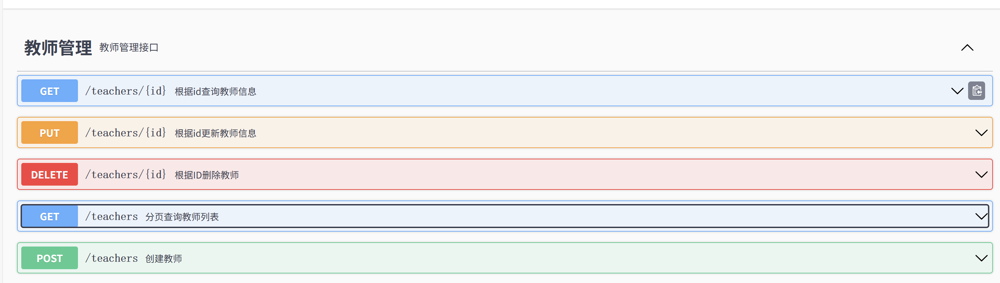

#   Server端开发分支

## 1.目标

搭建一个前端与数据库之间的中间层，为前端更新视图提供数据支持。

## 2.任务

1. 实现前端和后端之间的数据交换，即实现controllers

2. 实现后端与数据库之间的数据交换，即实现models和mappers

## 3.配置

| 软件          | 版本      |
| ------------- | --------- |
| IntelliJ IDEA | 2023.2.3  |
| DataGrip      | 2024.3.5  |
| apache-maven  | 3.6.1     |
| springboot    | 2.6.7     |
| java          | 1.8.0_202 |

## 4.开发指南

1. 初始项目的导入：先创建一个springboot2.7.6，java8的meven工程server（教程第2集，创建项目时不要选择创建git仓库，会导致git套嵌）然后再用仓库里的server文件夹的内容去替换对应的内容
2. 初始项目中配置了项目热部署、swagger-ui、mybatis-plus，启动项目后，可以通过浏览器访问 http://localhost:8088/swagger-ui.html 来查看已经编写好的后端接口
3. 请保证项目所在目录没有中文，否则可能会找不到主类所在路径导致项目启动失败
4. 首次启动项目请先git add，将经过替换操作的内容暂存，否则idea会忽略修改，导致启动失败
5. 请注重良好swagger注解，要求生成类似下图的页面：
   

6. 项目结构：

   | 名称       | 注解                                    |
   | ---------- | --------------------------------------- |
   | controller | 控制器，负责与前端交互                  |
   | service    | 服务层，负责处理具体的后端逻辑          |
   | mapper     | 映射层，负责与数据库交互                |
   | config     | 配置类，负责配置一些maven外部工具的属性 |
   | utils      | 工具类，存放一些通用的工具类            |
   | model      | 实体类，与数据库的每一张表一一对应      |

## 5.开发进度

| 表名/存储过程          | 完成 |
| ---------------------- | ---- |
| Teacher                | ✔    |
| OccupationType         | ✔    |
| OccupationRegistration |      |
| OccupationSchedule     | ✔    |
| Salary                 |      |
| Payment                |      |
| TeacherHours           | ✔    |
| OccupationDemand       | ✔    |

